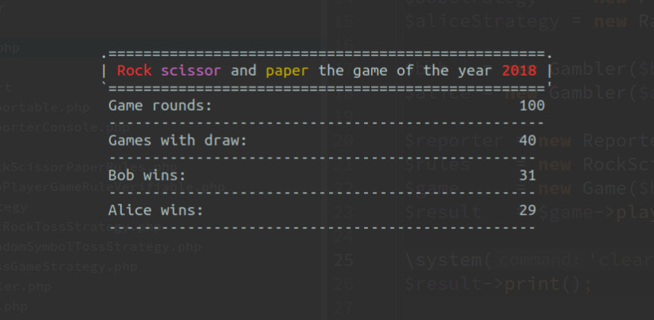

## SPIEL ##

The game of rock paper scissors, see [wiki](https://en.wikipedia.org/wiki/Rock%E2%80%93paper%E2%80%93scissors)

Implemented on PHP 7.2 with static typing enabled. Can in Docker Container to executed.

 - the ability to set a toss strategy for a player
 - the ability to expand or add new game rules
 - output of the game result to the console
 - the ability to set different options for displaying the result
 - it is impossible to change the rules and strategies at runtime

Automated Test and code coverage

##### Install 
After a successfully git clone or unzip of downloaded package we should install all dependency.
`docker-compose run --user 1000:1000 php composer install`  

Check application is ok
`docker-compose run --user 1000:1000 php composer check`

To setup app with you needs, go to `bin/` open `exe.php` and make needed changes. Eg change gambler strategy.

##### Preview

